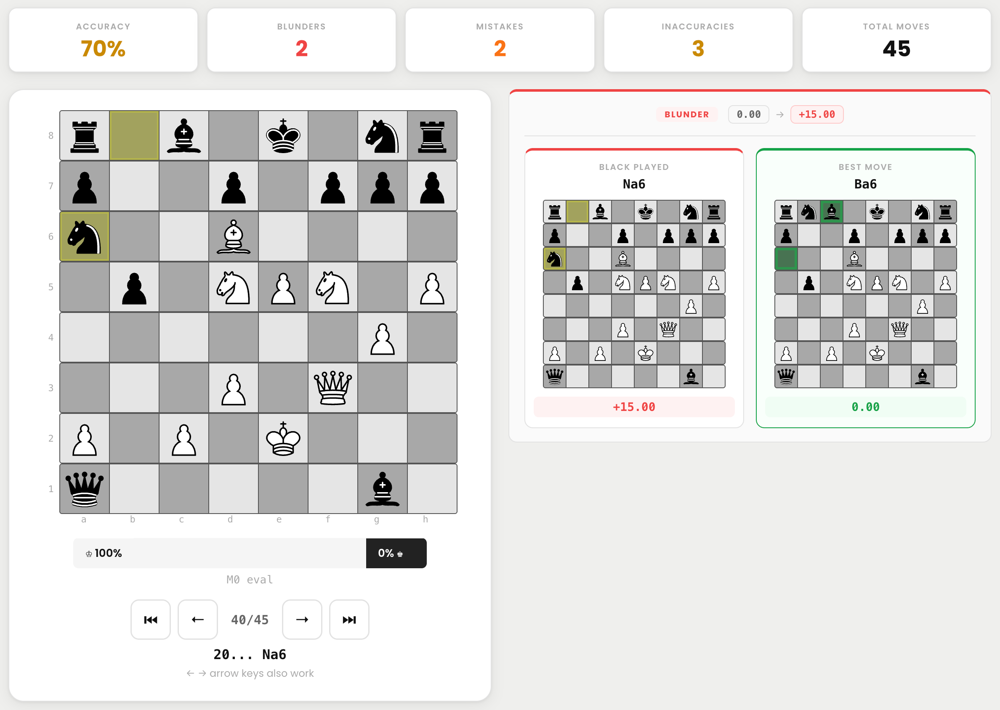

# PawnStar

A browser-based chess game analyzer powered by Stockfish 16. Paste any PGN, step through every move, and compare what you played to the engine's best alternative.

**Live site:** https://mithun-builds.github.io/pawnstar/



## Features

- **Stockfish 16 NNUE** running locally in a Web Worker — no API, no rate limits
- Move-by-move navigator with keyboard arrow support
- Visual eval bar showing white/black advantage
- Side-by-side comparison: your move vs engine's best move
- Accuracy, blunder, mistake, and inaccuracy counts per game
- Fully offline once loaded

## Running locally

A local web server is required (browsers block Web Workers over `file://`):

```bash
# macOS — double-click run.command, or run from terminal:
./run.command

# or manually:
python3 -m http.server 8080
```

Then open http://localhost:8080

## Deploying your own copy

Pure static site — no build step. After forking:

- **GitHub Pages**: Settings → Pages → Source: `main` branch, `/ (root)`. Live at `https://USERNAME.github.io/REPO/`.
- **Netlify / Vercel / Cloudflare Pages**: drop the folder in, or connect the repo. Zero config.

> The NNUE weights file (`nn-5af11540bbfe.nnue`) is ~38MB — GitHub Pages serves it fine; double-check bandwidth / file-size limits on other hosts.

Remember to update the canonical URL and Open Graph `og:url` / `og:image` in `index.html` to your own domain.

## License

GPL v3. See [LICENSE](LICENSE) for third-party component attributions (Stockfish, chess.js, Cburnett pieces, Poppins font).
